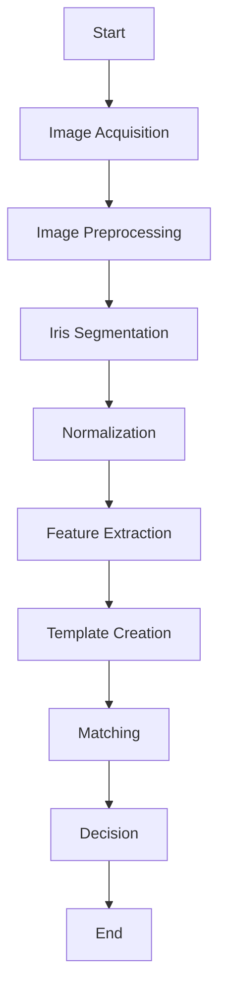

# IGCVCore Development Design Document

## Scope

This document is the main design document ofthe IGCVCore project.
the objective of this project is to design a modern soltuion for the IrisGuards iris Capture Algorithm.
OpenCV is the main library for this project and the code will be written in c++ using the Visual Studio 2022 IDE.

 

## General Approach of Iris Recognition
----

 

## Image Acquisition

 

 - Acquire an image of the iris using a suitable imaging device.

 - The Imaging Device used in the development of this project is an EyeTrust 2 by IrisGuard UK LTD.

- the format used will be BitMap with a resolution of 640 x 480 pixels

 

## Image Preprocessing

 

- Convert the image to Grayscale. (even if already in Grayscale).

- Denoise the image to remove noise and artifacts.

- Enhance contrast and adjust illumination to improve image quality.

- The Edge Detector that will be used will be Canny.

 

## Iris Segmentation

 

- Find the upper and lower EyeLid regions.

- Find the Pupil boundry. - Using Hough Circle Transform.

- Find the Limbic boundy of the iris. - Using Hough Circle Transform.

 

## Normalization

 

- Convert from cartesian to non-concentric polar representaion. "Rubber Sheet Unwrapping".

- Apply techniques to remove geometric distortions and ensure consistency across different iris images.

## Feature Extraction
 

- Analyze the normalized iris image to extract distinctive features.

- Using 2D Gabor Filters / 2D Gabor Wavelets.

## Template Creation
 

- The Normalised image is then applied to the filter to get the output.

## Matching
 

- Compare the generated iris template with stored templates or reference iris features.

- Utilize matching algorithms like Hamming distance, correlation-based methods, or machine learning approaches to measure similarity.

## Decision
 

- Apply a threshold or decision rule to determine if the iris in the acquired image matches any stored template.

- Make a decision based on the matching results to accept or reject the match.

## End
 

- Conclude the iris recognition process.

 

------

 

 

----------

 

#

