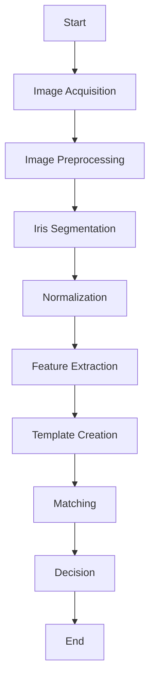

# IGCVCore Development Design Document

## Scope

The objective of this document is to descripe the steps of the new Iris Recognition system being developed by Kiefer Atkin @ IrisGuard UK LTD.

There are four key steps before the Iris Matching stage can be attempted and they are: Image Aquisition, Iris Segmintation, normalisaition and Encoding.

 

 

## Image Acquisition
 

 - Acquire an image of the iris using a suitable imaging device.

## Image Preprocessing
 

- Resize the acquired image.
- Denoise the image to remove noise and artifacts.
- Enhance contrast and adjust illumination to improve image quality.

## Iris Segmentation
 

- Use techniques like circular Hough transform or active contour models to locate the boundaries of the iris region.
- Extract the iris region from the rest of the image.

## Normalization
 

- Transform the segmented iris region into a standardized representation.
- Apply techniques to remove geometric distortions and ensure consistency across different iris images.

## Feature Extraction
 

- Analyze the normalized iris image to extract distinctive features.
- Use methods like Gabor filters, Daugman's rubber sheet model, or wavelet transforms to capture unique iris patterns and textures.

## Template Creation
 

- Create a template using the extracted iris features.
- The template represents a compact representation of the iris, allowing for efficient storage and comparison.

## Matching
 

- Compare the generated iris template with stored templates or reference iris features.
- Utilize matching algorithms like Hamming distance, correlation-based methods, or machine learning approaches to measure similarity.

## Decision
 

- Apply a threshold or decision rule to determine if the iris in the acquired image matches any stored template.
- Make a decision based on the matching results to accept or reject the match.

## End
 

- Conclude the iris recognition process.